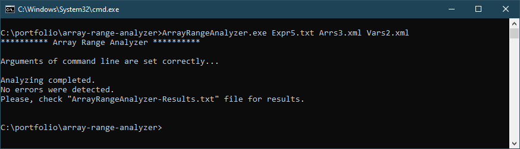
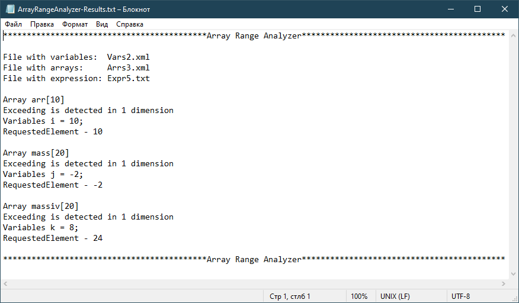

# Array Range Analyzer #

Консольная утилита для анализа переменной массива на языке С/С++.   
Позволяет отследить выход за пределы массива и обращение к несуществующему элементу при составлении циклов с заданным диапазонном изменения переменной массива.   
Пригодится при разработке других программ, содержащих большое количество повторяющихся действий и сложное выражение изменения переменных цикла внутри тела цикла.

## Ограничения ##

1. Поддерживаемые операции в выражении:
* +, -, *, /, -1, %  
* ++, -- (как постфиксная, так и префиксная)  
* =, +=, -=, *=, /=  
* []  
* (int)   
* abs(), ceil(), floor(), pow()  

2. Выражение в формате обратной польской записи
3. Не допускается использование вложенных квадратных скобок
4. Поддерживается не более 3 переменных цикла.

## Примечания ##

1. При использовании нескольких переменных, циклы считаются вложенными.
2. Левые и правые границы переменных считаются вложенными.
3. Предоставляется информация только о первом выходе массива, но для каждого массива и измерения(если не возникает критическая ошибка).
4. Если задается положительный шаг переменной цикла, то цикл будет считаться возрастающим; если отрицательный – цикл убывающий.
5. Для обнаружения зацикливания переменных массива (когда их значение повторяется от шага к шагу), можно задать счетчик зацикливания. Счетчик определяет максимальное количество повторных значений переменной.

## Использование ##
**Вход:**
1. Однострочное выражение на языке C или С++
2. Информация об использующихся в выражении переменных
3. Информация об использующихся в выражении массивах

**Выход:**
1. Файл с результатами проверки
2. Файл свозникшими ошибками(если они есть)

ArrayRangeAnalyzer.exe <expression.txt> <arrs.xml> <vars.xml> <loop-counter-value>
- expression.txt - файл с выражением
- arrs.xml - файл с информацией о массивах
- vars.xml - файл с информацией о переменных
- loop-counter-value - счетчик зацикливания  
    
[Примеры использования](FunctionalTests/)  
[Документация](Docs/)  
    
    
  Проект написан на языке C++ в учебных целях. Скомпилирован в Visual Studio 2013. Platform Toolset v120. Дополнительно используется Qt 5.1.1
  
  
  
